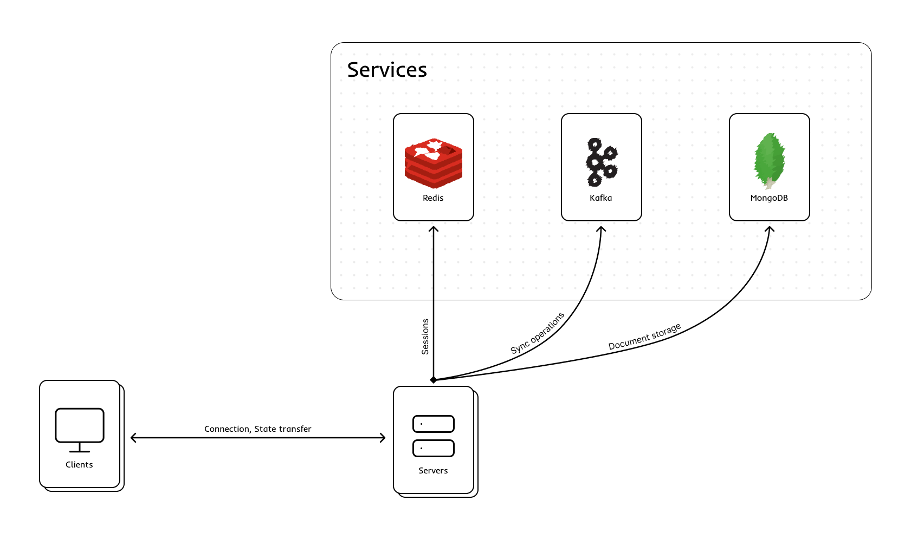

# Project Architecture

This document outlines the high-level architecture of the **sock-n-cock** application, its core components, interactions, and the underlying mechanisms that enable real-time collaboration.

## System Overview

The project is a distributed, real-time collaborative text editor. The architecture is built upon an Event-Driven model utilizing WebSockets for bidirectional communication with clients.

A key feature of this architecture is its capacity for horizontal scaling (Scale-Out) of the Application Servers. Data consistency across independent server instances is guaranteed by a unified message bus (Kafka) and a centralized session state store (Redis).

---

## System Components

The system is logically divided into three layers: **Client Layer**, **Application Server Layer**, and **Infrastructure Services**.

Note: Monaco code editor, presented as a client, is implemented as an example of a client for collaborative editing. Use of this client is unlimited, and any custom client can be implemented in place of the current client.

### 1. Client Example (Frontend)
* **Stack:** React, Vite, Monaco Editor, Socket.IO Client.
* **Responsibilities:**
  * Rendering the UI and the code editor (Monaco).
  * Capturing local code changes (Local Operations) and emitting them to the server via WebSockets.
  * Applying incoming remote changes (Remote Operations) using Operational Transformation (OT) logic.
  * Rendering remote cursors and text selections.
  * Display current online users working under document
  * Provides an opportunity to choose room for document editing 

### 2. Application Servers (Backend)
* **Stack:** FastAPI, Socket.IO, Python (asyncio).
* **Responsibilities:**
  * Handling WebSocket connections from clients.
  * Validating and routing incoming edit operations.
  * Resolving editing conflicts (Rebasing/OT) using the document's operation history (`collab.py`).
  * *Stateless Design:* Servers can be replicated in a cluster. Any server node can process requests from any client.

### 3. Infrastructure Services
These components ensure state synchronization across multiple App Server instances.

* **Kafka (Operation Bus / Sync Operations)**
  * Acts as a global operations log. When a server receives an edit from a client, it publishes the payload to the `code-changes` topic.
  * All servers (including the publisher) consume this topic. This guarantees Strict Total Ordering of operations for all clients, regardless of which server node they are connected to.
* **Redis (Presence & Sessions / User Sessions)**
  * Stores the ephemeral online state: mapping `doc_id` to connected `users` (including their generated colors and names).
  * Provides lightning-fast access to room participants without querying the primary database.
* **MongoDB (Persistent Storage / Document Storage)**
  * Stores the persistent state of documents: current text (`content`), incrementing `version`, and the latest operation `history`.
  * Writes are performed asynchronously with a debounce mechanism (Lazy Write / Delayed Save) to prevent database overloading during rapid keystrokes.

---

## Data Flows

### Connection & Document Hydration
1. The client establishes a WebSocket connection with the Load Balancer, which proxies the request to an available App Server.
2. The server registers the user in **Redis** (mapping `sid` to `doc_id`).
3. The server fetches the document from **MongoDB**. If it doesn't exist, an empty one is initialized.
4. The server broadcasts the updated user presence list from Redis to all room participants.
5. The server sends the current document state (`content` and `version`) to the joining client. The client enters the `isHydrated` state and is ready to edit.

### Real-time Collaboration (Operational Transformation)
To resolve concurrent editing conflicts, the system uses a custom rebasing algorithm similar to OT:
1. **Local Edit:** The user types. Monaco generates a local operation. The client emits a `client-op` (tagged with a `baseVersion`) to its App Server.
2. **Publish:** The App Server forwards this operation to **Kafka** (topic `code-changes`).
3. **Consume & Rebase:** Kafka consumers on *all* App Servers receive this message. The server compares the client's `baseVersion` against the server's current version. If the version is outdated, the server rebases the operation over the recent history (`collab.py -> rebase_operation`).
4. **Broadcast:** The App Server updates its local in-memory document state, increments the `version`, appends the operation to the `history`, and broadcasts a `server-update` to all clients in the room.
5. **Client Apply:** Clients receive the `server-update`, transform their own pending local operations if necessary, and apply the remote text to the Editor.

### State Persistence
* Upon every successful operation broadcast, the server cancels any pending save tasks and schedules a new one with a 1-second delay (`_save_to_db_delayed`).
* If no new edits occur within that second, the server asynchronously writes the current `content`, `version`, and truncated history (latest 200 operations) to **MongoDB** (upsert).
* A `document-saved` event is emitted to clients to trigger the "saved" UI indicator.

---

## Horizontal Scaling & Fault Tolerance

* **Distributed Processing:** Because conflict resolution relies on reading from a single, ordered message log (Kafka), the backend can be scaled out to any number of instances.
* **Network Communication:** To ensure Socket.IO Room Broadcasts work correctly across multiple servers, the architecture anticipates the integration of the `Socket.IO Redis Adapter` (allowing Server A to broadcast an event to a client connected to Server B).
* **Failure Isolation:** If a single App Server crashes, it only drops the connections of its active clients. Those clients will automatically reconnect to a healthy server, request the latest state, and resume collaboration without data loss, seamlessly synchronizing via the `version` vector.